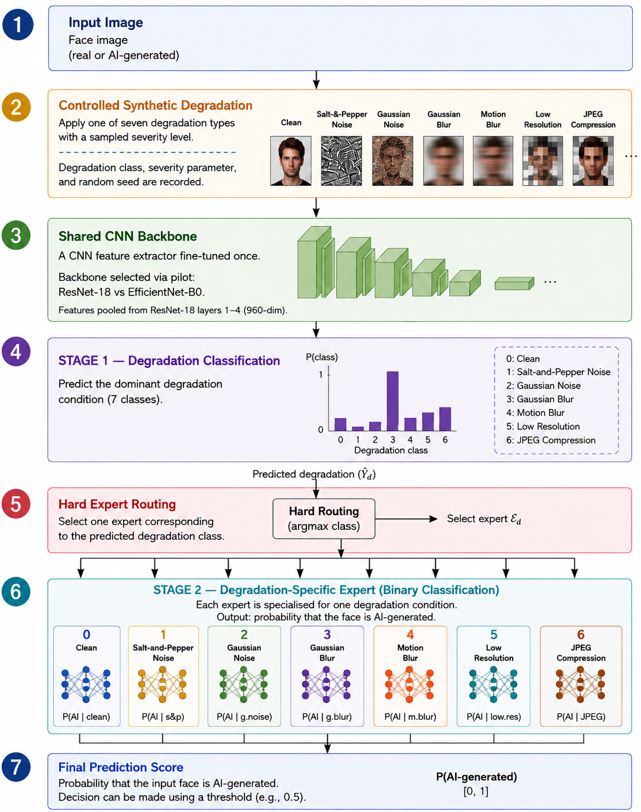
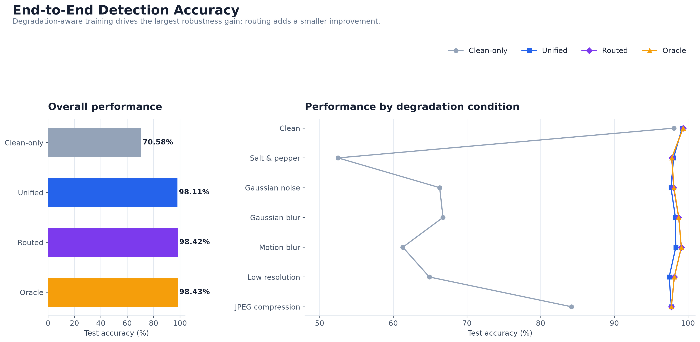
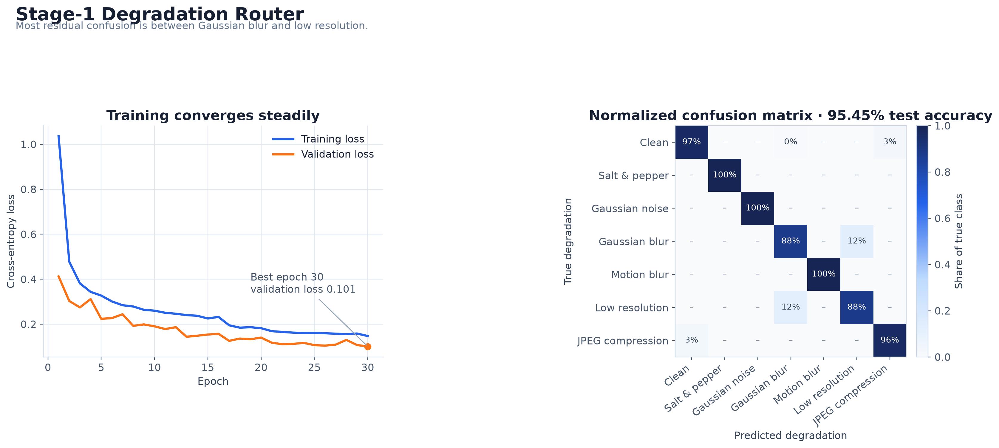
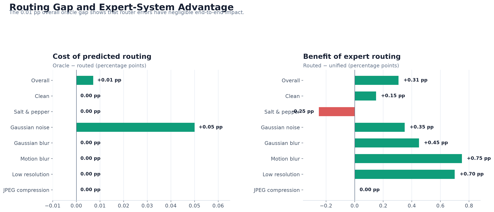
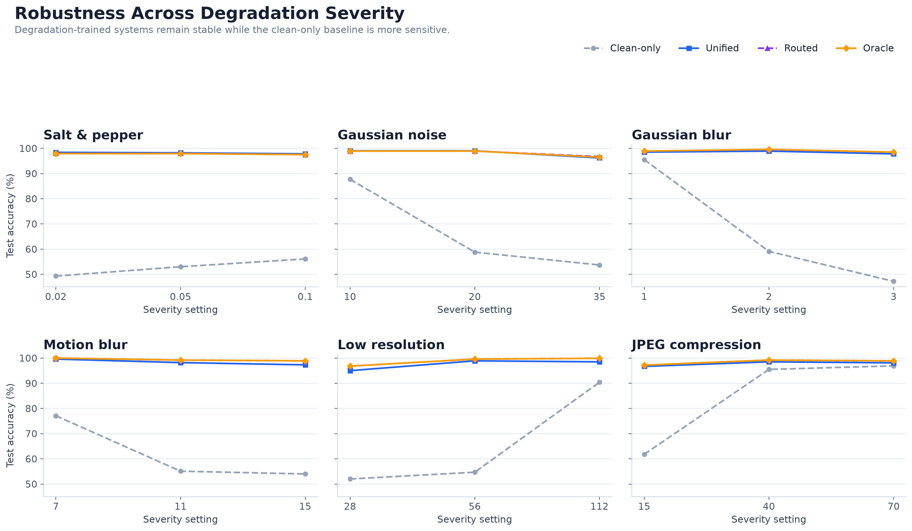

# Robust Detection of AI-Generated Faces Under Image Degradation

<p align="center">
  <b>Evaluating degradation-aware training and expert routing for robust AI-generated face detection.</b>
</p>

<p align="center">
  <a href="notebooks/degradation-aware-routing.ipynb">Final Notebook</a> •
  <a href="docs/case-study.md">Full Case Study</a> •
  <a href="results/README.md">Results</a> •
  <a href="https://github.com/sarahnish/portfolio">Portfolio</a>
</p>

## At a Glance

| | |
|---|---|
| **Problem** | Detect real vs AI-generated faces under blur, noise, compression and resolution loss |
| **Approach** | ResNet-18 + degradation classifier + 7 specialist expert heads |
| **Dataset** | 140K Real and Fake Faces |
| **Final Split** | 112K train · 14K validation · 14K test |
| **Router Accuracy** | **95.45%** |
| **Unified Detector** | **98.11%** |
| **Routed System** | **98.42%** |
| **Tech** | Python · PyTorch · torchvision · scikit-learn · OpenCV |

> **Key finding:** Training across degraded images produced most of the robustness gain. Expert routing improved the unified detector by only **+0.31 percentage points**.

## Project Overview

AI-generated face detectors can perform strongly on clean benchmark images but become less reliable after common image transformations such as compression, blur, noise and resolution loss.

This project evaluates whether identifying an image's degradation condition and routing it to a specialist classifier improves robustness.

Seven conditions were evaluated:

**Clean · Salt-and-pepper noise · Gaussian noise · Gaussian blur · Motion blur · Low resolution · JPEG compression**

---

## System Architecture

<p align="center">
  
</p>

The final system uses a **ResNet-18 backbone** to extract multi-scale features from layers 1–4 into a **960-dimensional representation**.

A Stage-1 classifier predicts the degradation type, which is then used to select one of seven specialist binary classifiers for the final real-versus-AI-generated prediction.

```text
Face Image
    ↓
ResNet-18
    ↓
Multi-Scale Features
    ↓
Degradation Classifier
    ↓
Hard Expert Routing
    ↓
Specialist Expert
    ↓
Real / AI-Generated
```

# Results

## 1. End-to-End Detection Performance

<p align="center">
  
</p>

| System | Overall Test Accuracy |
|---|---:|
| **Clean-only** | **70.58%** |
| **Unified** | **98.11%** |
| **Routed** | **98.42%** |
| **Oracle** | **98.43%** |

The largest improvement came from exposing the detector to degraded images during training.

```text
Clean-only → Unified
70.58% → 98.11%
+27.53 percentage points
```

Expert routing then produced a smaller additional improvement:

```text
Unified → Routed
98.11% → 98.42%
+0.31 percentage points
```

This suggests that **degradation-aware training contributed substantially more to robustness than specialist routing alone**.

---

## 2. Degradation Router

<p align="center">
  
</p>

The Stage-1 router achieved:

> **95.45% degradation-type test accuracy**

Salt-and-pepper noise, Gaussian noise and motion blur were identified particularly reliably.

The main remaining confusion occurred between:

> **Gaussian blur ↔ Low resolution**

Both degradation types reduce fine spatial detail, producing more similar feature representations.

---

## 3. Routing Error Analysis

<p align="center">
  
</p>

Oracle routing achieved **98.43% accuracy**, compared with **98.42%** using predicted degradation labels.

The difference was therefore only:

> **0.01 percentage points**

This indicates that remaining routing mistakes had very little practical effect on the final real-versus-AI-generated prediction.

The remaining performance limitations are more likely associated with the shared feature representation and the degree of specialisation learned by the expert heads.

---

## 4. Robustness Across Degradation Severity

<p align="center">
  
</p>

The severity analysis evaluates how model performance changes as degradation becomes stronger.

The **unified, routed and oracle systems remained comparatively stable across most tested severity levels**.

The routed and oracle curves also closely overlap, reinforcing the finding that routing errors were not the main performance bottleneck.

---

## What the Results Show

The strongest result from this project was **not** that expert routing dramatically improved detection.

The experiment showed that training on degraded images was the main factor improving robustness.

| Comparison | Improvement |
|---|---:|
| **Clean-only → Unified** | **+27.53 pp** |
| **Unified → Routed** | **+0.31 pp** |
| **Routed → Oracle** | **+0.01 pp** |

The clean-only detector achieved **70.58% accuracy**, while the unified degradation-trained detector reached **98.11%**.

Adding specialist routing increased performance to **98.42%**.

The very small routed-to-oracle gap also suggests that further improving the router alone would be unlikely to produce a large performance increase under the current architecture.

---
## Model Development

The final system uses:

- pretrained **ResNet-18** backbone
- pooled features from **ResNet layers 1–4**
- **960-dimensional** multi-scale feature representation
- seven-class Stage-1 degradation classifier
- seven degradation-specific MLP expert heads
- AdamW optimisation
- validation-based model selection
- learning-rate scheduling
- early stopping for feature-based classifiers
- controlled synthetic degradation generation
- reproducible random seeds

ResNet-18 was selected after comparison with **EfficientNet-B0** during backbone evaluation.

---

## Technical Highlights

- End-to-end deep-learning workflow in PyTorch
- Pretrained ResNet-18 feature extractor
- Multi-scale feature extraction
- Hard-routing mixture-of-experts architecture
- Seven-class degradation classification
- Seven specialist binary expert heads
- Controlled image-degradation pipeline
- Class-balanced experimental design
- Clean-only, unified, routed and oracle baselines
- Cached deep-feature training
- Robustness evaluation beyond clean benchmark accuracy
- Reproducible degradation parameters and random seeds

---

## Tech Stack

| Category | Tools & Technologies |
|---|---|
| **Language** | Python |
| **Deep Learning** | PyTorch · torchvision · ResNet-18 |
| **Machine Learning** | scikit-learn |
| **Image Processing** | OpenCV · Pillow |
| **Data & Numerical Computing** | pandas · NumPy |
| **Visualisation** | Matplotlib |
| **Environment** | Jupyter Notebook · Google Colab |
| **Dataset Access** | kagglehub |
| **Version Control** | Git · GitHub |
---

## Repository Structure

```text
deepfake-detection-robustness/
├── README.md
├── requirements.txt
├── .gitignore
│
├── assets/
│   └── system-architecture.png
│
├── notebooks/
│   ├── README.md
│   └── degradation-aware-routing.ipynb
│
└── results/
    ├── README.md
    ├── end-to-end-accuracy.png
    ├── router-performance.png
    ├── routing-gap-analysis.png
    └── severity-sweep.png
```
